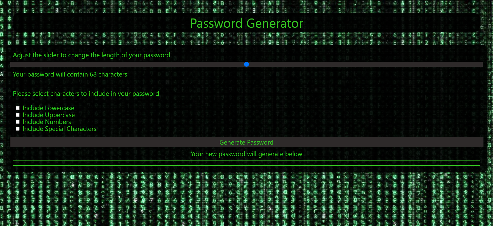

# password_generator_TJ

Passord generator using javascript

This page contains a header, with the title "Password generator" and a body section with a slider that adjusts the length of the final password, along with some check boxes to select what characters your password will contain.

A generate password button along the base of the body will either generate the password below it with the selected critera, or prompt the user to enter more information.

I only found out yesterday that this project has starter code, so my final product will be different from the regular one, but I believe it still fufills the critera, as well as being more user friendly with interactive features that dont take the user out of the window.

[live-website](https://tomjia98.github.io/password_generator_TJ/)

